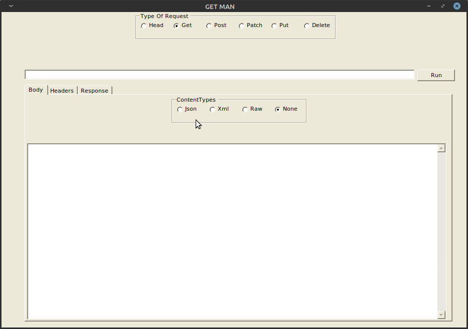

# GetMan
GetMan Rest client

## TODO
want to add in collections there is a left panel hidden for this and a base json model to store all important values just for v1 think this is a ok will add them in as and when
